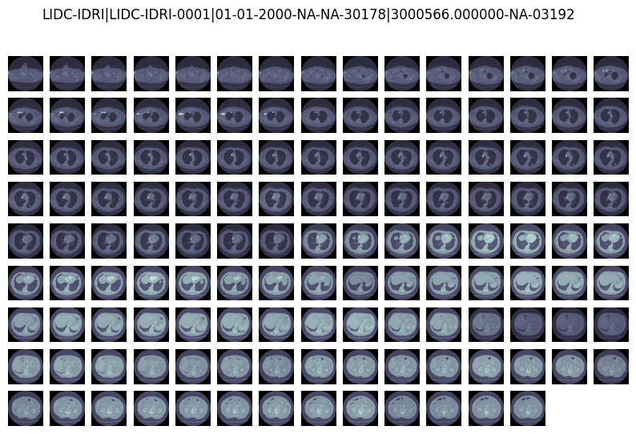
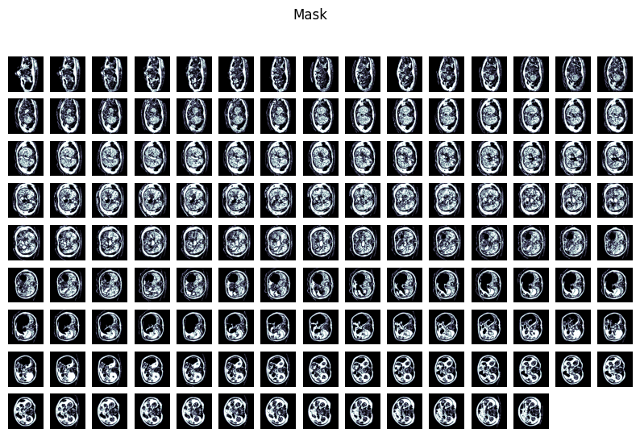
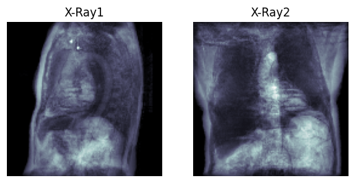

# README

## Introduction

This is the method used to generate synthetic X-ray images from CT volumes on [LIDC-IDRI dataset](https://wiki.cancerimagingarchive.net/display/Public/LIDC-IDRI), as introduced in the CVPR 2019 paper: [X2CT-GAN: Reconstructing CT from Biplanar X-Rays with Generative Adversarial Networks.](https://arxiv.org/abs/1905.06902)

## Dependence

glob, scipy, numpy, cv2, pfm, matplotlib, pydicom, SiimpleITK, re

## Usage Guidance

1. Install the DRR software from [here](https://sourceforge.net/p/plastimatch/activity/?page=0&limit=100#5ccb62c2f0d34730bafa130d) on a Windows computer, and we use 1.7.3.12-win64 version in our original work.

2. Download [LIDC-IDRI dataset](https://wiki.cancerimagingarchive.net/display/Public/LIDC-IDRI). (Note: Original dataset has a size of 125 GB. You could only download part of it, since this code could process it anyway)

3. In mhd_gen.py, set

    * RootPathDicom: path to LIDC-IDRI dataset

    * SaveRawData: path to save raw mhd file for ct processing in the next step

    * SaveMaskData: path to save mask that segment the lung for other part of the image by setting a threshold to HU value. Here we get mask by using `cv.threshold(slice, 0, 255, cv.THRESH_BINARY+cv.THRESH_OTSU)` from opencv-python

      Then execute this file to generate mask and raw mhd file

4. In ctpro.py, first set data path;
    * root_path ： original CT volume root 
    * mask_root_path ： CT mask without table
    * save_root_path ： save dir 
    * then execute ctpro.py to generate the normalized CT volumes.

5. In xraypro.py, again set the data path;
    * root_path ： the normalized data path, same as the save_root_path in ctpro.py file
    * save_root_path ：the Xray output path
    * plasti_path ： DDR software executable file location 
    * then execute xraypro.py to generate the synthetic Xrays. 

## Examples

Slices of LIDC-IDRI-0001|01-01-2000-NA-NA-30178|3000566.000000-NA-03192

Generated mask by running `mhd_gen.py`

Generated X-Ray by running `ctpro.py` and `xraypro.py`

